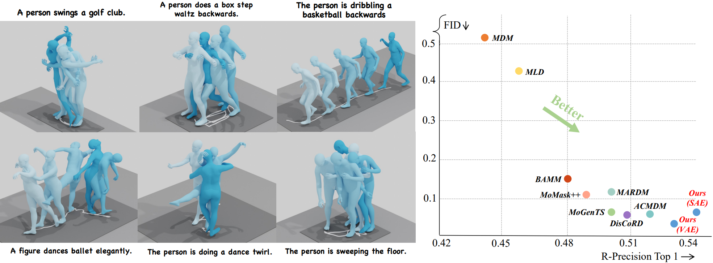

<p align="center">
<h1><strong>MoLingo: Motion-Language Alignment for Text-to-Motion Generation</strong></h1>
  <p align="center">
    <a href='https://virtualhumans.mpi-inf.mpg.de/people/He.html' target='_blank'>Yannan He</a>&emsp;
    <a href='https://garvita-tiwari.github.io/' target='_blank'>Garvita Tiwari</a>&emsp;
    <a href='https://virtualhumans.mpi-inf.mpg.de/people/Zhang.html' target='_blank'>Xiaohan Zhang</a>&emsp;
    <a href='https://www.linkedin.com/in/pankaj-bora-2045891b5/?originalSubdomain=de' target='_blank'>Pankaj Bora</a>&emsp;
    <a href='https://tolgabirdal.github.io/' target='_blank'>Tolga Birdal</a>&emsp;
    <a href='https://janericlenssen.github.io/' target='_blank'>Jan Eric Lenssen</a>&emsp;
    <a href='https://virtualhumans.mpi-inf.mpg.de/people/pons-moll.html' target='_blank'>Gerard Pons-Moll</a>&emsp;
    <br>
    <strong>CVPR 2026</strong>
  </p>
</p>

</p>
<p align="center">
  <a href='https://arxiv.org/abs/2512.13840'>
    </a>
  <!-- <a href='https://arxiv.org/pdf/xxxx.xxxxx.pdf'>
    </a> -->
<a href='https://hynann.github.io/molingo/MoLingo.html'>
    </a>
</p>



If you find our code or paper helpful, please consider starring our repository and citing:
```
@misc{he2025molingo,
      title={MoLingo: Motion-Language Alignment for Text-to-Motion Generation}, 
      author={Yannan He and Garvita Tiwari and Xiaohan Zhang and Pankaj Bora and Tolga Birdal and Jan Eric Lenssen and Gerard Pons-Moll},
      year={2025},
      eprint={2512.13840},
      archivePrefix={arXiv},
      primaryClass={cs.CV},
      url={https://arxiv.org/abs/2512.13840}, 
}
```

## News
- [2025-12-15] Publish the paper on arXiv
- [2026-02-16] Evaluation scripts released
- [2026-02-21] MoLingo is accepted at CVPR 2026, see you in Denver!

## TODO
- [x] Release the evaluation pipeline
- [ ] Release the motion generation pipeline
- [ ] Release the training script for the SAE
- [ ] Release the training script for the MoLingo model
- [ ] Release the G1 tracking pipeline


## Get You Ready

<details>

### 1. Conda Environment
```
conda env create -f environment.yml
conda activate molingo
```
We test our code on Python 3.10.13, PyTorch 2.9.0, and CUDA 12.8

### 2. Get Data

You have two options here:
* **Skip getting data**, if you just want to generate motions using *own* descriptions.
* **Get full data**, if you want to *re-train* and *evaluate* the model.

**(a) Original HumanML3D (263 dim)**

Follow the instruction in [HumanML3D](https://github.com/EricGuo5513/HumanML3D.git), then copy the result dataset to your own `data_root`

**(b) HumanML3D-272 (272 dim)**

Follow the instruction in [MotionStreamer](https://github.com/zju3dv/MotionStreamer), download the processed 272-dim HumanML3D dataset (not BABEL), store in your own `data_root`

After processing, the directory structure:

```
data_root
├── HumanML3D
│   ├── HumanML3D
│   │   └── new_joint_vecs
│   │   └── new_joints
│   │   └── pose_data
│   │   └── train.txt
│   │   └── val.txt
│   │   └── test.txt
│   │   └── Mean.npy
│   │   └── Std.npy
│   ├─ ...
├── HumanML3D_272
│   ├── mean_std
│   ├── motion_data
│   ├── split
│   ├── texts
```

### 3. Models and Dependencies

#### Download Evaluation Models and Gloves

```
bash prepare/download_evaluator.sh
bash prepare/download_glove.sh
```

#### Set up TMR-263 evaluator

**(Not required unless you are evaluating with the TMR-263 evaluator.)**

Follow the instruction in [TMR](https://github.com/Mathux/TMR) (Installation - Set up the datasets), then copy the result dataset to directory `mogen/checkpoints/TMR`

After processing, the directory structure:
 ```
TMR
├── datasets
│   ├── annotations
│   │   └── humanml3d
│   │   └── ...
│   ├── motions
│   │   └── guo3dfeats
│   │   └── ...
├── models
│   ├── tmr_humanml3d_guoh3dfeats
│   │   └── contrastive_metrics
│   │   └── last_weights
│           ├── motion_decoder.pt
│           ├── motion_encoder.pt
│           ├── text_encoder.pt
│   │   └── latents
│   │   └── ...
│   ├── ...
├── stats
│   ├── humanml3d
│   │   └── guo3dfeats
│           ├── mean.pt
│           ├── std.pt
│   ├── ...
    
 ```

#### Download Pre-trained Models
```
bash prepare/download_models.sh
```

#### 

</details>

## Demo

Coming soon

## Evaluation

<details>

### Evaluate the 263-dim model with TMR-263 and MARDM-67 evaluator:

```
python mogen/eval_mogen.py -d 263 -c 5.5 -a 3 -r 20 -dr {your_data_root}
```

### Evaluate the 272-dim model with MS-272 evaluator:

```
python mogen/eval_mogen.py -d 272 -c 7.0 -a 5 -r 20 -dr {your_data_root}
```
#### 

</details>

## Acknowledgments

This code is standing on the shoulders of giants, we would like to thank the following contributors that our code is based on:

[MAR](https://github.com/LTH14/mar/), [TMR](https://github.com/Mathux/TMR/)  [rectified-flow](https://github.com/lqiang67/rectified-flow/tree/main), [MoMask](https://github.com/EricGuo5513/momask-codes), [HumanML3D](https://github.com/EricGuo5513/HumanML3D), [MotionStreamer](https://github.com/zju3dv/MotionStreamer), [272-dim-Motion-Representation](https://github.com/Li-xingXiao/272-dim-Motion-Representation), [MARDM](https://github.com/neu-vi/MARDM)
